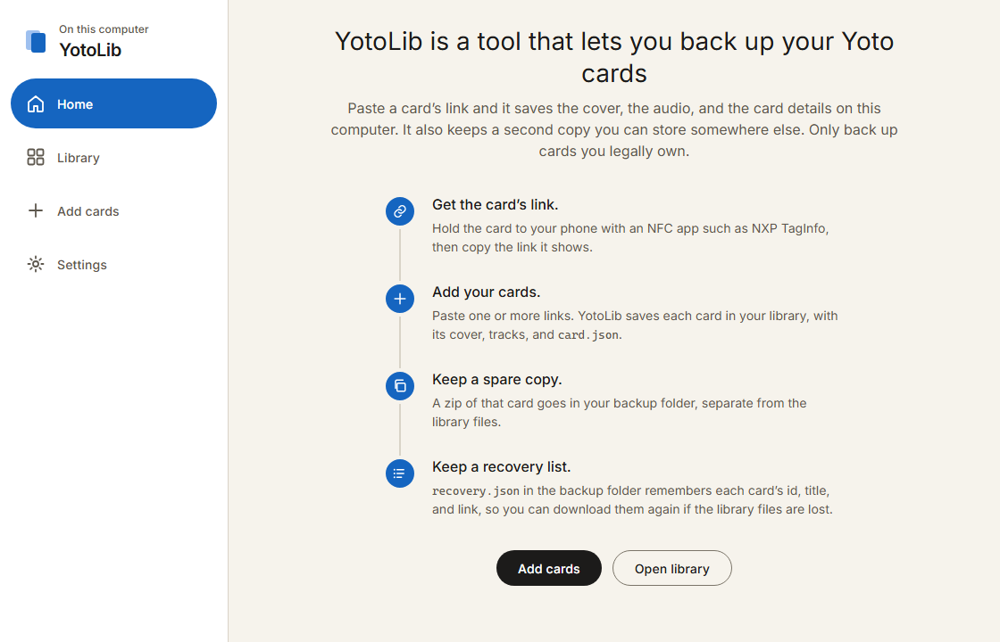
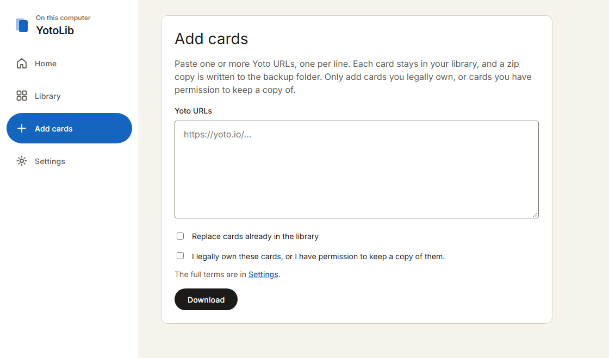
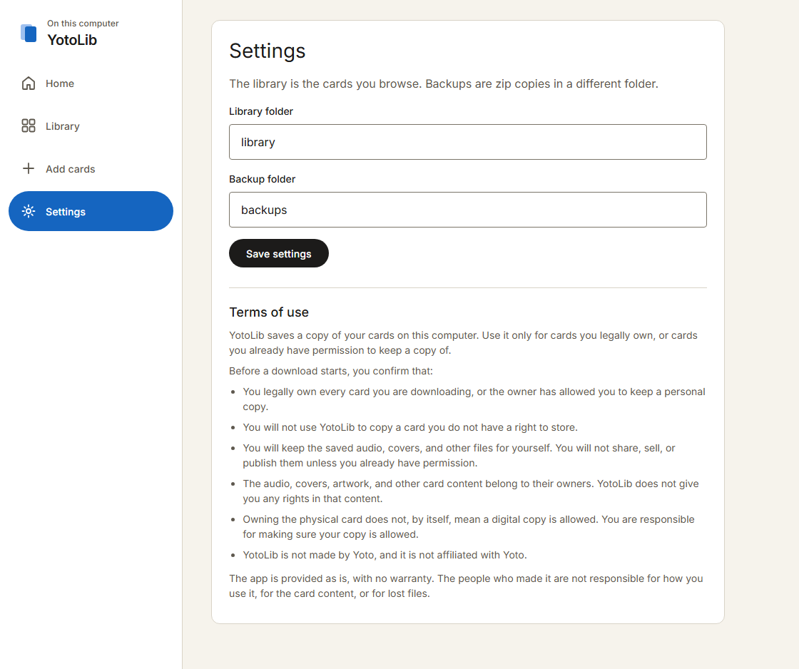

# YotoLib

YotoLib is a tool that lets you back up Yoto cards you already have a link for. Each card is kept in a library folder (cover, audio, and track list). A zip copy is written to a separate backup folder. Only back up cards you legally own, or cards you have permission to keep a copy of.

## Getting Started

[Releases](https://github.com/jodachecallan/yotolib/releases) include a built app for Windows, macOS, and Linux. No Python install is required. Closing the console window stops the app.

## Screenshots







## Setup

Requires Python 3.12.

```bash
git clone https://github.com/jodachecallan/yotolib.git
cd yotolib
python3 -m venv venv
```

Activate the virtual environment:

```bash
source venv/bin/activate
```

On Windows:

```bash
venv\Scripts\activate
```

Then install the dependencies:

```bash
pip install -r requirements.txt
```

## Run

```bash
python yotolib.py
```

The app binds to `127.0.0.1`, starting at port 8765, and opens in your browser. Closing the terminal stops it.

## Usage

1. In **Settings**, set a library folder and a different backup folder. The defaults are `library/` and `backups/` next to the app.
2. Read the card URL with the NXP TagInfo app ([App Store](https://apps.apple.com/es/app/nfc-taginfo-by-nxp/id1246143596), [Google Play](https://play.google.com/store/apps/details?id=com.nxp.taginfolite)): Scan & Launch, then hold the card to the phone.
3. In **Add cards**, paste one or more URLs, one per line. Confirm that you legally own the cards, or have permission to keep a copy, then download. The full terms are in **Settings**.
4. Each card is stored as `library/<card id>/` with `card.json`, the cover, `audio/`, and `images/`. A dated zip of that folder is written to the backup folder. Pasting a card that is already in the library skips it. Check **Replace cards already in the library** to download it again, replace the library folder, and write a new zip.
5. `backups/recovery.json` stores the card id, title, and URL for every card saved, including cards whose library folder was later removed. Use that list to download the library again.

## License

The application is MIT. See [LICENSE](LICENSE).

That license covers this program and its documentation. It does not cover Yoto card audio, covers, or other content the app downloads. The fonts in `static/fonts/` are under the [SIL Open Font License](static/fonts/OFL.txt).